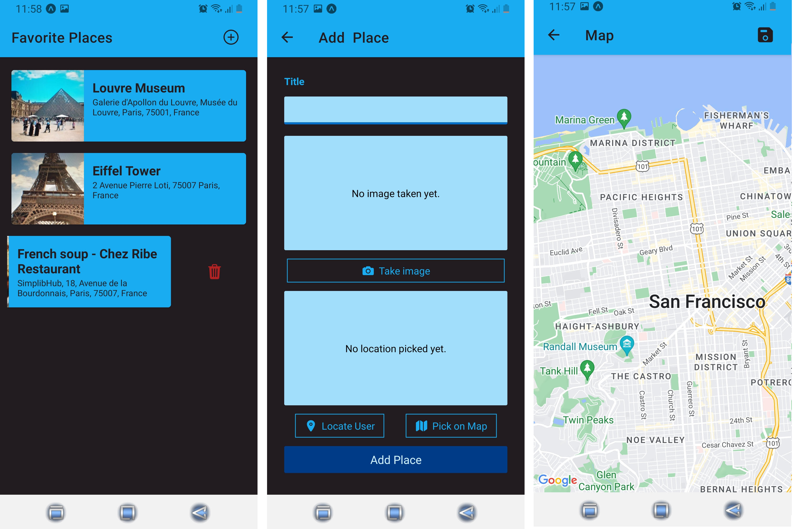

# Fav - Loc

The application allows users to collect and manage information about their favorite places visited.

### Features of App

- User can browse around favorite places and dive into the details of every place
- There several screens where user can view recent expenses and all expenses
- User can add new places (add a title of place, take a photo with device camera, pick a location on map or allow device to locate user)
- User can delete places

### Tech Stack

- React Native
- Expo
- Expo-sqlite
- Expo-location
- Expo-image-picker
- Expo-app-loading
- React Navigation package
- React-Native-Map

### Pages

Favorite Places screen (delete option) | Add place screen | Pick on Map screen

Favorite Places screen | Place details screen | View on Map screen

---

Feel free to install and play with this project.

Link to install app for Android devices -
<a href='https://expo.dev/accounts/olekpavlyk/projects/fav-loc/builds/93e78ca0-8fba-4ad7-a8ee-772f95364d29'>Download 'Fav-Loc App'</a>
